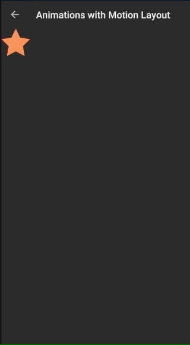
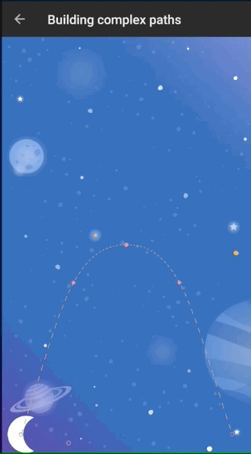
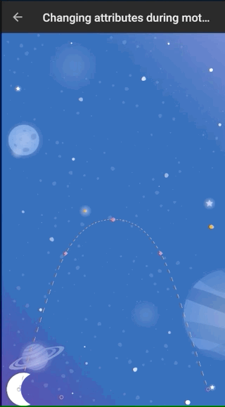
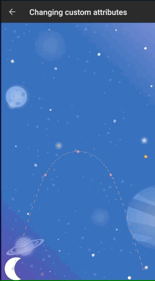
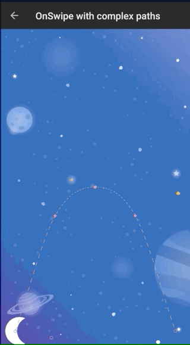

# Android-Motion-Layout
A collection sample animations showing the motion layout in action. It shows usage of

1. Click Base transitions
2. Swipe/drag based transitions
3. KeyPosition transitions
4. KeyAttribute transitions
5. CustomAttribute transitions
6. MotionLayout with CoordinatorLayout combination based transitions

        
